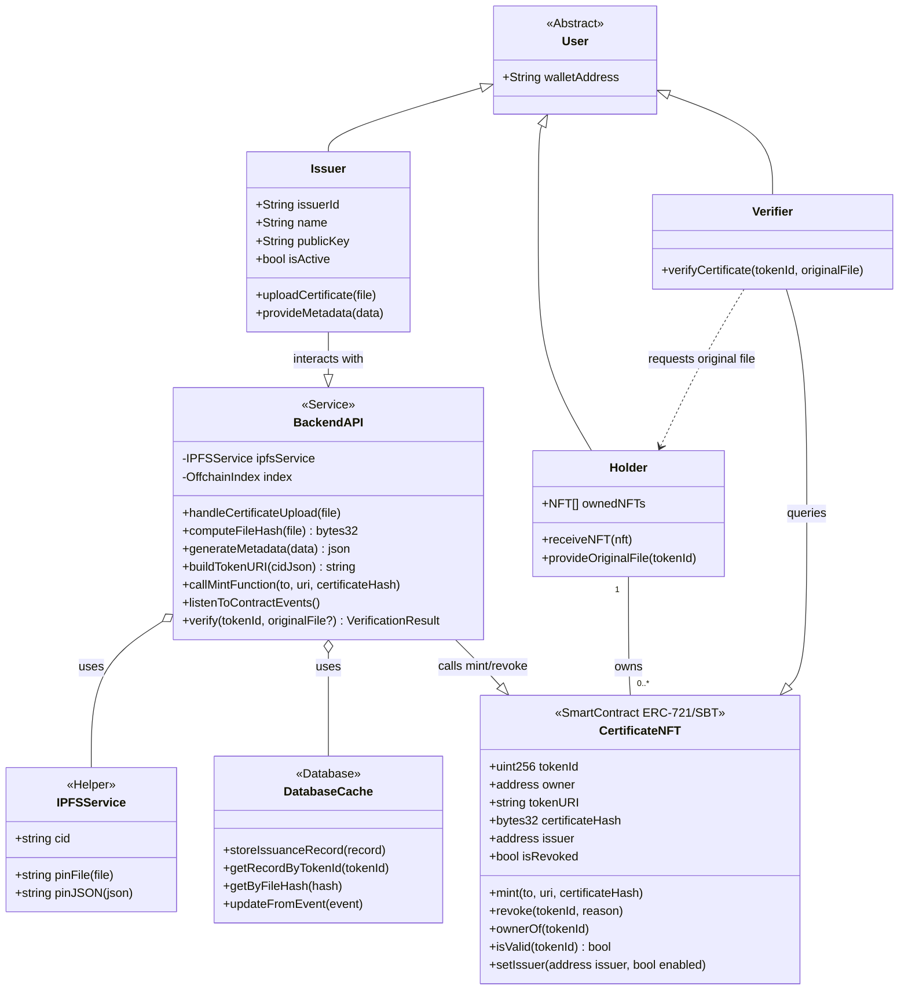
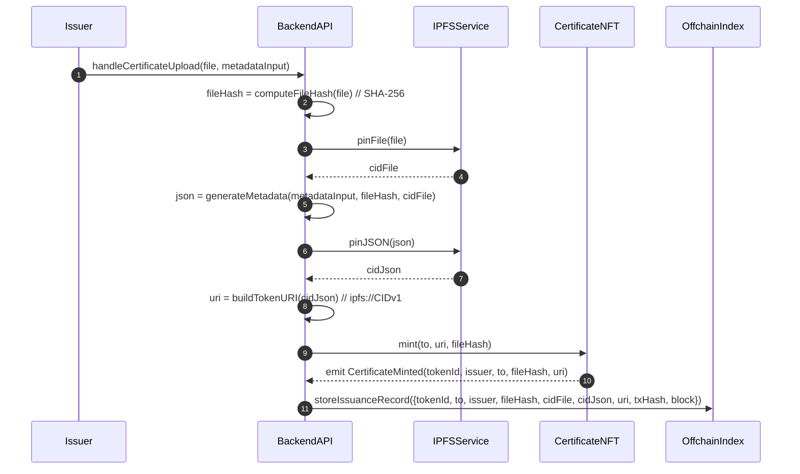
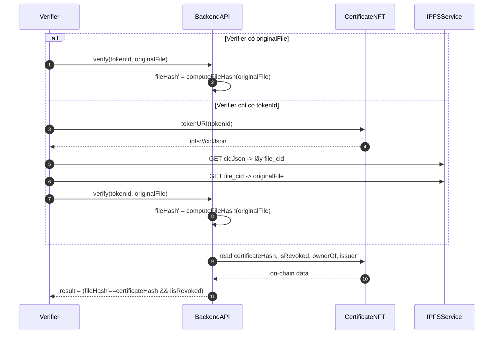
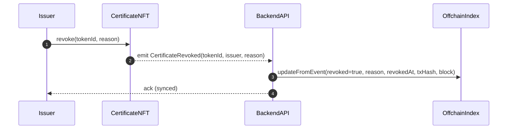

# Certificate as NFT — Extended Design Pack

> Version: 1.0.0 · Date: 2025-10-01 · Owner: You

This pack contains:
- Expanded **UML Class Diagram** (Mermaid)
- **Sequence Diagrams** for Mint / Verify / Revoke
- **ERC‑721 Metadata JSON** example
- **Tech Checklist** for implementation

---

## 1) UML Class Diagram (Mermaid)



---

## 2) Sequence Diagrams

### 2.1 Mint / Issuance


### 2.2 Verify


### 2.3 Revoke


---

## 3) ERC‑721 Metadata JSON (Example)

```json
{
  "name": "Bachelor of Science - Alice Nguyen",
  "description": "Verifiable certificate issued by ABC University.",
  "image": "ipfs://bafy.../preview.png",
  "external_url": "https://verify.example.org/cert/12345",
  "attributes": [
    { "trait_type": "issuer_name", "value": "ABC University" },
    { "trait_type": "program", "value": "Computer Science" },
    { "trait_type": "issued_at", "value": "2025-09-20T00:00:00Z" },
    { "trait_type": "expires_at", "value": "" },
    { "trait_type": "chain_id", "value": 42161 },
    { "trait_type": "policy", "value": "non-transferable" }
  ],
  "certificate_hash": "0x1f3a...abcd",
  "file_cid": "bafybeigdyr...xyz",
  "issuer": "0xIssuerAddress",
  "schema_version": "1.0.0"
}
```

---

## 4) Technical Checklist

- [ ] File hash normalized (**SHA‑256**) and written **on‑chain**.
- [ ] `ipfs://CIDv1` URIs; metadata compliant with **ERC‑721**.
- [ ] Event‑driven indexing (`CertificateMinted`, `CertificateRevoked`) + reorg handling.
- [ ] Role‑based control in contract (**AccessControl / ISSUER_ROLE**).
- [ ] Transfer policy: **SBT** (ERC‑5192/5484) for personal certificates.
- [ ] No raw PII on chain/metadata; hash/anonymize where necessary.
- [ ] Verify = hash match + not revoked + trusted issuer.
- [ ] Reissue / wallet recovery plan (burn + remint per policy).
```

